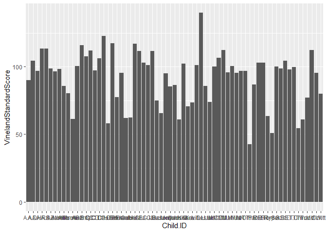

\#Testing change \# Assignment 1, Language development in Autism
Spectrum Disorder (ASD) - Brushing up your code skills

In this first part of the assignment we will brush up your programming
skills, and make you familiar with the data sets you will be analysing
for the next parts of the assignment.

In this warm-up assignment you will: 1) Create a Github (or gitlab)
account, link it to your RStudio, and create a new repository/project 2)
Use small nifty lines of code to transform several data sets into just
one. The final data set will contain only the variables that are needed
for the analysis in the next parts of the assignment 3) Warm up your
tidyverse skills (especially the sub-packages stringr and dplyr), which
you will find handy for later assignments.

N.B: Usually you’ll also have to doc/pdf with a text. Not for Assignment
1.

Learning objectives:
--------------------

-   Become comfortable with tidyverse (and R in general)
-   Test out the git integration with RStudio
-   Build expertise in data wrangling (which will be used in future
    assignments)

0. First an introduction on the data
------------------------------------

Language development in Autism Spectrum Disorder (ASD)
======================================================

Reference to the study:
<a href="https://www.ncbi.nlm.nih.gov/pubmed/30396129" class="uri">https://www.ncbi.nlm.nih.gov/pubmed/30396129</a>

Background: Autism Spectrum Disorder (ASD) is often related to language
impairment, and language impairment strongly affects the patients
ability to function socially (maintaining a social network, thriving at
work, etc.). It is therefore crucial to understand how language
abilities develop in children with ASD, and which factors affect them
(to figure out e.g. how a child will develop in the future and whether
there is a need for language therapy). However, language impairment is
always quantified by relying on the parent, teacher or clinician
subjective judgment of the child, and measured very sparcely (e.g. at 3
years of age and again at 6).

In this study we videotaped circa 30 kids with ASD and circa 30
comparison kids (matched by linguistic performance at visit 1) for ca.
30 minutes of naturalistic interactions with a parent. We repeated the
data collection 6 times per kid, with 4 months between each visit. We
transcribed the data and counted: i) the amount of words that each kid
uses in each video. Same for the parent. ii) the amount of unique words
that each kid uses in each video. Same for the parent. iii) the amount
of morphemes per utterance (Mean Length of Utterance) displayed by each
child in each video. Same for the parent.

Different researchers involved in the project provide you with different
datasets: 1) demographic and clinical data about the children (recorded
by a clinical psychologist) 2) length of utterance data (calculated by a
linguist) 3) amount of unique and total words used (calculated by a
fumbling jack-of-all-trade, let’s call him RF)

Your job in this assignment is to double check the data and make sure
that it is ready for the analysis proper (Assignment 2), in which we
will try to understand how the children’s language develops as they grow
as a function of cognitive and social factors and which are the “cues”
suggesting a likely future language impairment.

1. Let’s get started on GitHub
------------------------------

In the assignments you will be asked to upload your code on Github and
the GitHub repositories will be part of the portfolio, therefore all
students must make an account and link it to their RStudio (you’ll thank
us later for this!).

Follow the link to one of the tutorials indicated in the syllabus: \*
Recommended:
<a href="https://happygitwithr.com/" class="uri">https://happygitwithr.com/</a>
\* Alternative (if the previous doesn’t work):
<a href="https://support.rstudio.com/hc/en-us/articles/200532077-Version-Control-with-Git-and-SVN" class="uri">https://support.rstudio.com/hc/en-us/articles/200532077-Version-Control-with-Git-and-SVN</a>
\* Alternative (if the previous doesn’t work):
<a href="https://docs.google.com/document/d/1WvApy4ayQcZaLRpD6bvAqhWncUaPmmRimT016-PrLBk/mobilebasic" class="uri">https://docs.google.com/document/d/1WvApy4ayQcZaLRpD6bvAqhWncUaPmmRimT016-PrLBk/mobilebasic</a>

N.B. Create a GitHub repository for the Assignment 1 and link it to a
project on your RStudio.

2. Now let’s take dirty dirty data sets and make them into a tidy one
---------------------------------------------------------------------

If you’re not in a project in Rstudio, make sure to set your working
directory here. If you created an RStudio project, then your working
directory (the directory with your data and code for these assignments)
is the project directory.

``` r
pacman::p_load(tidyverse,janitor,ggplot2)
```

Load the three data sets, after downloading them from dropbox and saving
them in your working directory: \* Demographic data for the
participants:
<a href="https://www.dropbox.com/s/w15pou9wstgc8fe/demo_train.csv?dl=0" class="uri">https://www.dropbox.com/s/w15pou9wstgc8fe/demo_train.csv?dl=0</a>
\* Length of utterance data:
<a href="https://www.dropbox.com/s/usyauqm37a76of6/LU_train.csv?dl=0" class="uri">https://www.dropbox.com/s/usyauqm37a76of6/LU_train.csv?dl=0</a>
\* Word data:
<a href="https://www.dropbox.com/s/8ng1civpl2aux58/token_train.csv?dl=0" class="uri">https://www.dropbox.com/s/8ng1civpl2aux58/token_train.csv?dl=0</a>

``` r
demo_train <- read.csv("demo_train.csv")
LU_train <- read.csv("LU_train.csv")
token_train <- read.csv("token_train.csv")

demo_train <- arrange(demo_train, VinelandStandardScore)
ggplot(demo_train, aes(Child.ID, VinelandStandardScore))+
  geom_bar(stat ="summary", fun.data ="mean_se")
```

    ## Warning: Removed 3 rows containing non-finite values (stat_summary).



Explore the 3 datasets (e.g. visualize them, summarize them, etc.). You
will see that the data is messy, since the psychologist collected the
demographic data, the linguist analyzed the length of utterance in May
2014 and the fumbling jack-of-all-trades analyzed the words several
months later. In particular: - the same variables might have different
names (e.g. participant and visit identifiers) - the same variables
might report the values in different ways (e.g. participant and visit
IDs) Welcome to real world of messy data :-)

Before being able to combine the data sets we need to make sure the
relevant variables have the same names and the same kind of values.

So:

2a. Identify which variable names do not match (that is are spelled
differently) and find a way to transform variable names. Pay particular
attention to the variables indicating participant and visit.

Tip: look through the chapter on data transformation in R for data
science
(<a href="http://r4ds.had.co.nz" class="uri">http://r4ds.had.co.nz</a>).
Alternatively you can look into the package dplyr (part of tidyverse),
or google “how to rename variables in R”. Or check the janitor R
package. There are always multiple ways of solving any problem and no
absolute best method.

``` r
#Changing column names in demo_train 

colnames(demo_train)[1] <- "SUBJ"
colnames(demo_train)[2] <- "VISIT"
```

2b. Find a way to homogeneize the way “visit” is reported (visit1
vs. 1).

Tip: The stringr package is what you need. str\_extract () will allow
you to extract only the digit (number) from a string, by using the
regular expression \\d.

``` r
#Homogenizing the numbers in the columns 

#This line of code says: take this column and make it <- extract from the string(in this column, the regular expression for numbers) --> "\\d" apparently means all numbers 
LU_train$VISIT <- stringr::str_extract(LU_train$VISIT, regex("\\d"))
token_train$VISIT <- stringr::str_extract(token_train$VISIT, regex("\\d"))
```

2c. We also need to make a small adjustment to the content of the
Child.ID coloumn in the demographic data. Within this column, names that
are not abbreviations do not end with “.” (i.e. Adam), which is the case
in the other two data sets (i.e. Adam.). If The content of the two
variables isn’t identical the rows will not be merged. A neat way to
solve the problem is simply to remove all “.” in all datasets.

Tip: stringr is helpful again. Look up str\_replace\_all Tip: You can
either have one line of code for each child name that is to be changed
(easier, more typing) or specify the pattern that you want to match
(more complicated: look up “regular expressions”, but less typing)

``` r
LU_train$SUBJ <- str_replace_all(LU_train$SUBJ, "\\.", "")
token_train$SUBJ <- str_replace_all(token_train$SUBJ, "\\.", "")
demo_train$SUBJ <- str_replace_all(demo_train$SUBJ, "\\.", "")
```

2d. Now that the nitty gritty details of the different data sets are
fixed, we want to make a subset of each data set only containig the
variables that we wish to use in the final data set. For this we use the
tidyverse package dplyr, which contains the function select().

The variables we need are: \* Child.ID, \* Visit, \* Diagnosis, \*
Ethnicity, \* Gender, \* Age, \* ADOS,  
\* MullenRaw, \* ExpressiveLangRaw, \* Socialization \* MOT\_MLU, \*
CHI\_MLU, \* types\_MOT, \* types\_CHI, \* tokens\_MOT, \* tokens\_CHI.

Most variables should make sense, here the less intuitive ones. \* ADOS
(Autism Diagnostic Observation Schedule) indicates the severity of the
autistic symptoms (the higher the score, the worse the symptoms). Ref:
<a href="https://link.springer.com/article/10.1023/A:1005592401947" class="uri">https://link.springer.com/article/10.1023/A:1005592401947</a>
\* MLU stands for mean length of utterance (usually a proxy for
syntactic complexity) \* types stands for unique words (e.g. even if
“doggie” is used 100 times it only counts for 1) \* tokens stands for
overall amount of words (if “doggie” is used 100 times it counts for
100) \* MullenRaw indicates non verbal IQ, as measured by Mullen Scales
of Early Learning (MSEL
<a href="https://link.springer.com/referenceworkentry/10.1007%2F978-1-4419-1698-3_596" class="uri">https://link.springer.com/referenceworkentry/10.1007%2F978-1-4419-1698-3_596</a>)
\* ExpressiveLangRaw indicates verbal IQ, as measured by MSEL \*
Socialization indicates social interaction skills and social
responsiveness, as measured by Vineland
(<a href="https://cloudfront.ualberta.ca/-/media/ualberta/faculties-and-programs/centres-institutes/community-university-partnership/resources/tools---assessment/vinelandjune-2012.pdf" class="uri">https://cloudfront.ualberta.ca/-/media/ualberta/faculties-and-programs/centres-institutes/community-university-partnership/resources/tools---assessment/vinelandjune-2012.pdf</a>)

Feel free to rename the variables into something you can remember
(i.e. nonVerbalIQ, verbalIQ)

``` r
sub_demo_train <- select(demo_train, SUBJ, VISIT, Diagnosis, Ethnicity, Gender, Age, ADOS, MullenRaw,ExpressiveLangRaw, Socialization)

sub_token_train <- select(token_train, SUBJ, VISIT, types_MOT, types_CHI, tokens_MOT, tokens_CHI)

sub_LU_train <- select(LU_train, SUBJ, VISIT, MOT_MLU, CHI_MLU)
```

2e. Finally we are ready to merge all the data sets into just one.

Some things to pay attention to: \* make sure to check that the merge
has included all relevant data (e.g. by comparing the number of rows) \*
make sure to understand whether (and if so why) there are NAs in the
dataset (e.g. some measures were not taken at all visits, some
recordings were lost or permission to use was withdrawn)

``` r
token_LU <- merge(sub_token_train, sub_LU_train, by=c("SUBJ","VISIT"))
merged_data<- merge(token_LU, sub_demo_train, by=c("SUBJ","VISIT"))
```

2f. Only using clinical measures from Visit 1 In order for our models to
be useful, we want to miimize the need to actually test children as they
develop. In other words, we would like to be able to understand and
predict the children’s linguistic development after only having tested
them once. Therefore we need to make sure that our ADOS, MullenRaw,
ExpressiveLangRaw and Socialization variables are reporting (for all
visits) only the scores from visit 1.

A possible way to do so: \* create a new dataset with only visit 1,
child id and the 4 relevant clinical variables to be merged with the old
dataset \* rename the clinical variables (e.g. ADOS to ADOS1) and remove
the visit (so that the new clinical variables are reported for all 6
visits) \* merge the new dataset with the old

``` r
#Making new dataset 
visit1_df <- merged_data %>% select(SUBJ, VISIT, ADOS, MullenRaw, ExpressiveLangRaw, Socialization) %>% filter(VISIT == "1")

colnames(visit1_df)[3] <- "ADOSv1"
colnames(visit1_df)[4] <- "MullenRawv1"
colnames(visit1_df)[5] <- "ExpressiveLangRawv1"
colnames(visit1_df)[6] <- "Socializationv1"

visit1_df <- select(visit1_df,-VISIT)

merged_data2 <- merge(merged_data, visit1_df, by = "SUBJ")
```

2g. Final touches

Now we want to \* anonymize our participants (they are real children!).
\* make sure the variables have sensible values. E.g. right now gender
is marked 1 and 2, but in two weeks you will not be able to remember,
which gender were connected to which number, so change the values from 1
and 2 to F and M in the gender variable. For the same reason, you should
also change the values of Diagnosis from A and B to ASD (autism spectrum
disorder) and TD (typically developing). Tip: Try taking a look at
ifelse(), or google “how to rename levels in R”. \* Save the data set
using into a csv file. Hint: look into write.csv()

``` r
#Changing gender 
merged_data2$Gender <- ifelse(merged_data2$Gender == "1", "M", "F")

#Anonymizing the participants 
merged_data2$SUBJ <- as.factor(merged_data2$SUBJ)
merged_data2$SUBJ <- factor(as.numeric(merged_data2$SUBJ))

#Changing diagnosis to more meaningful
merged_data2$Diagnosis <- ifelse(merged_data2$Diagnosis == "A", "ASD", "TD")

write.csv(merged_data2, file = "AutismClean.csv")
```

1.  BONUS QUESTIONS The aim of this last section is to make sure you are
    fully fluent in the tidyverse. Here’s the link to a very helpful
    book, which explains each function:
    <a href="http://r4ds.had.co.nz/index.html" class="uri">http://r4ds.had.co.nz/index.html</a>

2.  USING FILTER List all kids who:

<!-- -->

1.  have a mean length of utterance (across all visits) of more than 2.7
    morphemes.
2.  have a mean length of utterance of less than 1.5 morphemes at the
    first visit
3.  have not completed all trials. Tip: Use pipes to solve this

``` r
long_LMU <- filter(merged_data2, CHI_MLU>2.7)
long_LMU
```

    ##    SUBJ VISIT types_MOT types_CHI tokens_MOT tokens_CHI  MOT_MLU  CHI_MLU
    ## 1     1     5       601       182       2553        472 5.209615 3.238095
    ## 2     1     6       595       210       2586        686 4.664013 2.865169
    ## 3     2     2       307       171       1270        562 4.964664 3.453039
    ## 4     2     3       351       262       1445        983 4.147059 3.119318
    ## 5     2     4       335       200       1286        674 5.309804 4.302326
    ## 6     2     6       304       245        999        698 4.588477 3.413502
    ## 7     3     4       449       206       2397        754 5.301053 3.929204
    ## 8     3     5       534       207       2672        588 4.566038 3.298578
    ## 9     3     6       486       173       2564        460 5.229885 3.710345
    ## 10    4     3       388       165       1788        490 3.818681 3.518072
    ## 11    4     4       356       163       1711        479 4.301624 3.257143
    ## 12    4     5       397       146       2082        539 4.602851 4.043478
    ## 13    4     6       410       166       2171        738 3.532374 3.278195
    ## 14    5     4       384       187       2685        604 4.744000 2.907258
    ## 15    5     6       462       179       3182        538 4.587179 2.766520
    ## 16    8     4       375       134       2069        493 4.658333 3.026596
    ## 17    9     4       400       121       1934        390 4.262195 2.775641
    ## 18    9     5       428       121       1879        346 4.384946 2.835821
    ## 19   10     6       400        73       2271        189 4.235585 2.705128
    ## 20   11     6       260       168       1138        666 4.287582 2.757143
    ## 21   12     3       318       169       1463        733 4.974684 3.185771
    ## 22   12     4       197       122        632        243 3.988304 3.000000
    ## 23   12     5       290       222       1467        916 4.910494 4.364754
    ## 24   12     6       339       201       1498        640 4.468493 3.504950
    ## 25   13     4       463       203       2361        538 4.083700 2.798283
    ## 26   13     5       511       247       2668        932 4.487842 3.230114
    ## 27   13     6       388       210       1959        864 4.847418 3.701195
    ## 28   14     5       390       238       1864        755 4.446281 3.375000
    ## 29   14     6       359       178       1802        793 4.664286 3.811404
    ## 30   15     6       327       156       1395        410 4.347709 2.869048
    ## 31   16     2       391       196       2303        733 4.750455 2.744108
    ## 32   16     3       408       200       2675        825 4.164789 2.807692
    ## 33   16     5       517       219       2762        583 5.433579 3.109524
    ## 34   16     6       491       250       2264        710 4.445872 2.948207
    ## 35   18     2       461       160       2687        738 4.357911 2.722034
    ## 36   18     3       487       201       2479        940 4.116057 3.340000
    ## 37   18     4       565       207       2965       1092 4.131579 3.212821
    ## 38   18     5       575       219       2881        769 3.877102 3.090278
    ## 39   18     6       516       235       2576       1079 4.013353 2.909535
    ## 40   20     6       433       155       2389        590 5.379798 2.902778
    ## 41   22     5       436       178       1965        686 4.746606 3.700000
    ## 42   22     6       478       221       2044        847 4.211321 3.091195
    ## 43   25     3       455       217       2589        826 4.127941 2.804217
    ## 44   25     4       553       291       2978       1225 5.362500 3.731092
    ## 45   25     5       578       298       2940       1145 4.267409 2.741379
    ## 46   25     6       555       237       2895       1010 4.472993 3.061453
    ## 47   26     1       278       119       1450        483 4.690751 3.400000
    ## 48   26     3       333       307       1668       1293 4.316279 3.919689
    ## 49   26     4       398       188       2518        714 4.857143 3.523810
    ## 50   26     5       437       261       2410       1154 4.345515 3.291990
    ## 51   26     6       452       273       3076       1249 4.111413 3.364341
    ## 52   28     5       272       177       1098        622 3.708934 3.585253
    ## 53   28     6       391       164       1889        521 4.239437 2.960784
    ## 54   31     3       396       233       1872       1246 3.552459 2.987526
    ## 55   31     4       480       186       2233        750 3.667638 2.727273
    ## 56   37     5       407       228       2314        815 4.658802 2.746875
    ## 57   37     6       429       217       2510        897 4.240798 3.077419
    ## 58   38     3       420       175       2146        825 4.577491 2.869048
    ## 59   38     5       447       210       1999        800 4.917927 3.518519
    ## 60   40     4       430       180       2377        493 3.812930 2.990000
    ## 61   41     6       397       213       1741        702 4.061475 2.852632
    ## 62   42     4       339       193       1726        820 4.611247 3.830040
    ## 63   42     5       358       213       1600        875 3.921444 3.774908
    ## 64   42     6       357       219       1764        719 3.391525 3.072797
    ## 65   43     5       396       262       2326       1054 4.232258 2.866505
    ## 66   44     5       307       131       1207        433 4.113846 3.200000
    ## 67   47     4       343       211       1559        973 4.190698 3.162242
    ## 68   47     5       315       131       1224        304 3.673418 2.738806
    ## 69   47     6       322        34       1371         61 4.676101 2.760000
    ## 70   49     3       323       151       1609        671 4.737127 3.112450
    ## 71   49     4       340       229       1452        684 4.880240 3.480952
    ## 72   49     5       425       209       1525        586 5.743772 3.537143
    ## 73   49     6       383       217       1701        646 5.247093 3.595000
    ## 74   51     4       363       112       1829        348 4.137014 3.028986
    ## 75   51     5       388       108       1986        238 5.185941 2.921569
    ## 76   51     6       383       140       1866        395 5.153639 2.761290
    ## 77   52     3       474       200       2142        897 5.288991 3.303754
    ## 78   52     4       554       177       2585        642 5.338462 3.077551
    ## 79   52     5       563       219       2772        723 4.983389 2.832168
    ## 80   53     2       197       126        686        449 4.557471 3.217949
    ## 81   53     3       219       152       1020        660 4.078292 3.131356
    ## 82   53     4       232       217        798        978 4.458937 3.634069
    ## 83   53     5       278       217       1067        814 4.857143 3.822581
    ## 84   53     6       249       102       1024        358 3.706790 3.243902
    ## 85   54     4       332       153       1699        694 3.819961 3.406504
    ## 86   54     5       394       244       1977        725 3.750000 3.607287
    ## 87   54     6       437       183       2347        517 4.186161 2.892157
    ## 88   55     4       318       205       1524       1051 4.177340 2.862069
    ## 89   55     6       367       260       1731       1294 3.957230 2.909274
    ## 90   59     4       330       157       1974        637 4.697624 2.714829
    ## 91   59     6       303       158       1460        659 4.113158 2.848000
    ## 92   60     1       400       149       2587        469 3.604140 2.876344
    ## 93   60     2       413       149       2534        670 4.604341 2.784000
    ## 94   60     3       459       196       2841        698 4.907591 4.131868
    ## 95   60     4       539       214       3163        693 4.085409 3.359833
    ## 96   60     5       521       145       3090        357 4.223572 2.965517
    ## 97   60     6       505       226       3072        713 4.080446 3.441558
    ##    Diagnosis    Ethnicity Gender   Age ADOS MullenRaw ExpressiveLangRaw
    ## 1         TD        White      M 35.90    0        NA                NA
    ## 2         TD        White      M 40.13   NA        42                44
    ## 3        ASD        White      M 33.17   NA        NA                NA
    ## 4        ASD        White      M 37.07   NA        NA                NA
    ## 5        ASD        White      M 41.07   NA        49                NA
    ## 6        ASD        White      M 49.70   NA        48                48
    ## 7         TD        White      F 35.53   NA        39                NA
    ## 8         TD        White      F 39.47    0        NA                NA
    ## 9         TD        White      F 45.07   NA        45                45
    ## 10       ASD White/Latino      M 38.90   NA        NA                NA
    ## 11       ASD White/Latino      M 43.13   NA        41                NA
    ## 12       ASD White/Latino      M 47.40    9        NA                NA
    ## 13       ASD White/Latino      M 51.37   NA        44                44
    ## 14       ASD        White      M 45.53   NA        38                NA
    ## 15       ASD        White      M 54.13   NA        40                37
    ## 16        TD        White      M 32.07   NA        42                NA
    ## 17        TD        White      F 31.07   NA        45                NA
    ## 18        TD        White      F 35.00    1        NA                NA
    ## 19        TD        White      M 40.43   NA        33                33
    ## 20        TD        White      M 40.27   NA        42                27
    ## 21        TD        White      M 28.27   NA        NA                NA
    ## 22        TD        White      M 32.07   NA        42                NA
    ## 23        TD        White      M 35.87    0        NA                NA
    ## 24        TD        White      M 41.50   NA        44                47
    ## 25        TD        White      M 31.03   NA        40                NA
    ## 26        TD        White      M 35.37    0        NA                NA
    ## 27        TD        White      M 39.40   NA        47                41
    ## 28        TD        White      M 35.10    0        NA                NA
    ## 29        TD        White      M 39.43   NA        44                37
    ## 30        TD        White      M 40.30   NA        40                40
    ## 31        TD        White      M 26.27   NA        NA                NA
    ## 32        TD        White      M 30.63   NA        NA                NA
    ## 33        TD        White      M 38.17    0        NA                NA
    ## 34        TD        White      M 42.93   NA        49                46
    ## 35        TD        White      M 26.13   NA        NA                NA
    ## 36        TD        White      M 30.03   NA        NA                NA
    ## 37        TD        White      M 34.43   NA        50                NA
    ## 38        TD        White      M 38.70    0        NA                NA
    ## 39        TD        White      M 44.07   NA        50                50
    ## 40       ASD        White      M 37.30   NA        43                48
    ## 41        TD        White      F 35.13    0        NA                NA
    ## 42        TD        White      F 39.23   NA        43                40
    ## 43        TD        White      M 30.13   NA        NA                NA
    ## 44        TD        White      M 34.00   NA        47                NA
    ## 45        TD        White      M 37.93    0        NA                NA
    ## 46        TD        White      M 42.47   NA        48                39
    ## 47       ASD        White      M 30.40   11        32                33
    ## 48       ASD        White      M 38.60   NA        NA                NA
    ## 49       ASD        White      M 42.63   NA        41                NA
    ## 50       ASD        White      M 46.93    4        NA                NA
    ## 51       ASD        White      M 51.00   NA        46                46
    ## 52        TD        White      M 36.43    0        NA                NA
    ## 53        TD        White      M 39.43   NA        39                32
    ## 54        TD        White      M 32.07   NA        NA                NA
    ## 55        TD        White      M 35.03   NA        43                NA
    ## 56       ASD        White      M 55.17    4        NA                NA
    ## 57       ASD        White      M 58.77   NA        50                48
    ## 58        TD        White      F 28.07   NA        NA                NA
    ## 59        TD        White      F 36.13    0        NA                NA
    ## 60       ASD     Lebanese      M    NA   NA        NA                NA
    ## 61        TD        White      M 39.93   NA        45                36
    ## 62        TD        White      M 32.07   NA        39                NA
    ## 63        TD        White      M 36.40    0        NA                NA
    ## 64        TD        White      M 40.13   NA        46                46
    ## 65       ASD        White      M 53.40   11        NA                NA
    ## 66        TD        White      M 35.83    1        NA                NA
    ## 67        TD        White      F 32.13   NA        42                NA
    ## 68        TD        White      F 39.10   NA        NA                NA
    ## 69        TD        White      F 40.37   NA        43                46
    ## 70        TD        White      M 31.63   NA        NA                NA
    ## 71        TD        White      M 35.63   NA        45                NA
    ## 72        TD        White      M 39.47    0        NA                NA
    ## 73        TD        White      M 43.40   NA        45                48
    ## 74        TD        Asian      F 34.43   NA        30                NA
    ## 75        TD        Asian      F 37.67    3        NA                NA
    ## 76        TD        Asian      F 42.10   NA        46                40
    ## 77        TD        White      M 30.77   NA        NA                NA
    ## 78        TD        White      M 35.03   NA        45                NA
    ## 79        TD        White      M 38.60    0        NA                NA
    ## 80        TD        White      M 28.60   NA        NA                NA
    ## 81        TD        White      M 32.50   NA        NA                NA
    ## 82        TD        White      M 36.40   NA        45                NA
    ## 83        TD        White      M 40.07    0        NA                NA
    ## 84        TD        White      M 44.43   NA        45                36
    ## 85        TD        White      M 30.83   NA        39                NA
    ## 86        TD        White      M 35.17    0        NA                NA
    ## 87        TD        White      M 39.30   NA        41                41
    ## 88        TD        White      M 32.03   NA        40                NA
    ## 89        TD        White      M 41.93   NA        45                38
    ## 90        TD        White      M 33.60   NA        34                NA
    ## 91        TD        White      M 41.00   NA        NA                NA
    ## 92       ASD        White      M 34.00   13        30                30
    ## 93       ASD        White      M 38.63   NA        NA                NA
    ## 94       ASD        White      M 42.47   NA        NA                NA
    ## 95       ASD        White      M 47.00   NA        47                NA
    ## 96       ASD        White      M 51.13   15        NA                NA
    ## 97       ASD        White      M 54.73   NA        50                50
    ##    Socialization ADOSv1 MullenRawv1 ExpressiveLangRawv1 Socializationv1
    ## 1            107      0          28                  14             108
    ## 2            100      0          28                  14             108
    ## 3            105     13          34                  27              85
    ## 4             77     13          34                  27              85
    ## 5             75     13          34                  27              85
    ## 6             81     13          34                  27              85
    ## 7             93      1          29                  18              88
    ## 8             86      1          29                  18              88
    ## 9             86      1          29                  18              88
    ## 10            81      8          31                  27              82
    ## 11            77      8          31                  27              82
    ## 12            79      8          31                  27              82
    ## 13            74      8          31                  27              82
    ## 14            77      9          34                  27              82
    ## 15            75      9          34                  27              82
    ## 16           109      5          32                  31             102
    ## 17           103      0          24                  18             100
    ## 18           107      0          24                  18             100
    ## 19           103      3          27                  18             104
    ## 20           101      0          21                  15             106
    ## 21           105      0          30                  16             104
    ## 22           103      0          30                  16             104
    ## 23           101      0          30                  16             104
    ## 24            97      0          30                  16             104
    ## 25           107      0          25                  17             102
    ## 26           100      0          25                  17             102
    ## 27            92      0          25                  17             102
    ## 28            87      0          23                  17              92
    ## 29            83      0          23                  17              92
    ## 30            94      0          24                  15              86
    ## 31           102      0          29                  26             102
    ## 32            95      0          29                  26             102
    ## 33           103      0          29                  26             102
    ## 34            97      0          29                  26             102
    ## 35           107      0          29                  33             106
    ## 36           112      0          29                  33             106
    ## 37           105      0          29                  33             106
    ## 38           118      0          29                  33             106
    ## 39           116      0          29                  33             106
    ## 40           103      9          26                  14              86
    ## 41           114      0          21                  19             106
    ## 42           110      0          21                  19             106
    ## 43           100      0          29                  22              90
    ## 44           102      0          29                  22              90
    ## 45           101      0          29                  22              90
    ## 46           103      0          29                  22              90
    ## 47           100     11          32                  33             100
    ## 48            83     11          32                  33             100
    ## 49            86     11          32                  33             100
    ## 50            97     11          32                  33             100
    ## 51            90     11          32                  33             100
    ## 52           100      0          20                  16             102
    ## 53            95      0          20                  16             102
    ## 54           107      0          27                  22             100
    ## 55           107      0          27                  22             100
    ## 56           105      7          33                  26              70
    ## 57           116      7          33                  26              70
    ## 58           125      1          29                  28             104
    ## 59           120      1          29                  28             104
    ## 60            86     13          27                  13              86
    ## 61           101      0          25                  17             102
    ## 62           109      0          24                  19              96
    ## 63           100      0          24                  19              96
    ## 64           101      0          24                  19              96
    ## 65            77     14          42                  27              65
    ## 66           107      3          30                  20              94
    ## 67            93      0          27                  20             102
    ## 68            95      0          27                  20             102
    ## 69           101      0          27                  20             102
    ## 70           105      0          27                  27             108
    ## 71           105      0          27                  27             108
    ## 72           101      0          27                  27             108
    ## 73           101      0          27                  27             108
    ## 74           120      1          22                  14             102
    ## 75           112      1          22                  14             102
    ## 76           108      1          22                  14             102
    ## 77           103      0          29                  22              94
    ## 78           100      0          29                  22              94
    ## 79            94      0          29                  22              94
    ## 80            86      0          30                  30              98
    ## 81           107      0          30                  30              98
    ## 82           108      0          30                  30              98
    ## 83           103      0          30                  30              98
    ## 84           101      0          30                  30              98
    ## 85           105      1          24                  22             115
    ## 86           105      1          24                  22             115
    ## 87           101      1          24                  22             115
    ## 88            93      0          26                  17              96
    ## 89            95      0          26                  17              96
    ## 90           116      4          29                  22             108
    ## 91            NA      4          29                  22             108
    ## 92            87     13          30                  30              87
    ## 93            46     13          30                  30              87
    ## 94           100     13          30                  30              87
    ## 95           100     13          30                  30              87
    ## 96            92     13          30                  30              87
    ## 97            97     13          30                  30              87

``` r
MLU2 <- filter(merged_data2, CHI_MLU<1.5 & VISIT =="1")
MLU2
```

    ##    SUBJ VISIT types_MOT types_CHI tokens_MOT tokens_CHI  MOT_MLU   CHI_MLU
    ## 1     1     1       378        14       1835        139 3.621993 1.2522523
    ## 2     5     1       324        57       2859        197 3.986357 1.3947368
    ## 3     6     1       212         4        761         29 2.618729 1.0000000
    ## 4     7     1       152        29        578        130 2.244755 1.2641509
    ## 5     9     1       363        36       1408        137 3.544419 1.0378788
    ## 6    10     1       289        15       1808         83 4.204846 1.0375000
    ## 7    11     1       215        24       1136        101 3.380463 1.2168675
    ## 8    12     1       235        17       1262         62 4.195335 1.0877193
    ## 9    14     1       287         7       1625        105 3.420315 1.0396040
    ## 10   15     1       277        27       1643         99 3.967078 1.1647059
    ## 11   17     1       281         9       1418         37 3.182390 1.0277778
    ## 12   19     1       283        89       1019        227 2.539823 1.3595506
    ## 13   20     1       321        16       1787        214 2.524740 0.1857143
    ## 14   21     1       485         8       2826        122 4.390879 1.0000000
    ## 15   22     1       343        36       1698        118 3.630476 1.2371134
    ## 16   23     1       328        41       2138        103 3.024548 1.4324324
    ## 17   24     1       193         6        654         26 2.917355 1.0833333
    ## 18   27     1       317        37       1361         95 3.616867 1.3661972
    ## 19   28     1       178        34        584        111 2.788793 1.2758621
    ## 20   29     1       295         6       1643        117 3.304189 1.0086207
    ## 21   30     1       366        11       2054         21 3.607088 0.9000000
    ## 22   33     1       206        13        788         35 2.287293 1.2500000
    ## 23   34     1       214        67        893        180 2.743455 1.3766234
    ## 24   35     1       291        24       1344        260 3.561364 1.2641509
    ## 25   36     1       281         8       1631         16 3.921109 1.2307692
    ## 26   37     1       381        39       1988        337 4.135036 0.4805825
    ## 27   38     1       342        96       2035        398 3.420975 1.3322785
    ## 28   39     1       274        36       1537        109 3.298748 1.2043011
    ## 29   40     1       252         9       1827         58 2.997050 1.0175439
    ## 30   41     1       333        32       1547        235 3.093146 1.0262009
    ## 31   42     1       373        47       2334        176 4.033333 1.3034483
    ## 32   44     1       275         9       1417         68 3.088757 1.2592593
    ## 33   45     1       258        20       1188         91 2.776181 0.5584416
    ## 34   46     1       387        10       2144         63 4.883966 1.1666667
    ## 35   47     1       260        13       1347        212 3.943005 1.0761421
    ## 36   48     1       303        17       2147         40 3.765528 1.2500000
    ## 37   49     1       255        73       1452        286 4.030075 1.4258373
    ## 38   50     1       265         8       1215         43 3.704110 1.1000000
    ## 39   51     1       331         7       1503         38 3.435743 1.1818182
    ## 40   52     1       441        92       2267        319 5.344227 1.4086957
    ## 41   54     1       214        32       1118        109 3.487871 1.3139535
    ## 42   55     1       178        11       1144        154 3.509138 1.1846154
    ## 43   56     1       195         9        955         47 2.548969 1.0444444
    ## 44   57     1       386         0       2613          0 3.833770 0.0000000
    ## 45   58     1       338        98       2084        233 2.747100 1.1809045
    ## 46   59     1       345        62       1805        244 3.432387 1.1830065
    ## 47   61     1       303        15       1579        166 3.030405 1.0375000
    ##    Diagnosis        Ethnicity Gender   Age ADOS MullenRaw
    ## 1         TD            White      M 19.80    0        28
    ## 2        ASD            White      M 34.03    9        34
    ## 3        ASD      Bangladeshi      F 26.17   17        20
    ## 4        ASD            White      F 41.00   18        24
    ## 5         TD            White      F 18.30    0        24
    ## 6         TD            White      M 19.27    3        27
    ## 7         TD            White      M 19.23    0        21
    ## 8         TD            White      M 20.07    0        30
    ## 9         TD            White      M 18.97    0        23
    ## 10        TD            White      M 19.27    0        24
    ## 11       ASD            White      M 34.80   14        25
    ## 12       ASD            White      M 35.80   11        28
    ## 13       ASD            White      M 18.77    9        26
    ## 14       ASD African American      M 27.53   21        22
    ## 15        TD            White      F 18.93    0        21
    ## 16       ASD     White/Latino      M 27.37   14        25
    ## 17       ASD            White      M 37.47   20        13
    ## 18        TD            White      M 21.03    0        26
    ## 19        TD            White      M 19.93    0        20
    ## 20       ASD            White      M 34.87   17        26
    ## 21       ASD            White      M 36.53   12        31
    ## 22       ASD African American      F 25.33   14        25
    ## 23       ASD            White      M 33.77   10        27
    ## 24        TD            White      M 19.30    1        23
    ## 25        TD            White      M 19.20    3        19
    ## 26       ASD            White      M 39.50    7        33
    ## 27        TD            White      F 19.87    1        29
    ## 28       ASD      White/Asian      M 33.20   11        26
    ## 29       ASD         Lebanese      M 24.90   13        27
    ## 30        TD            White      M 19.23    0        25
    ## 31        TD            White      M 19.37    0        24
    ## 32        TD            White      M 19.77    3        30
    ## 33        TD            White      M 20.03    5        24
    ## 34       ASD            White      M 36.73   20        21
    ## 35        TD            White      F 20.03    0        27
    ## 36       ASD            White      M 31.63   17        28
    ## 37        TD            White      M 23.07    0        27
    ## 38       ASD            White      M 37.47   19        17
    ## 39        TD            Asian      F 20.87    1        22
    ## 40        TD            White      M 22.57    0        29
    ## 41        TD            White      M 19.10    1        24
    ## 42        TD            White      M 19.97    0        26
    ## 43       ASD            White      M 35.50   14        27
    ## 44       ASD            White      F 41.07   15        28
    ## 45       ASD            White      M 26.00   15        30
    ## 46        TD            White      M 20.80    4        29
    ## 47       ASD            White      M 42.00   15        27
    ##    ExpressiveLangRaw Socialization ADOSv1 MullenRawv1 ExpressiveLangRawv1
    ## 1                 14           108      0          28                  14
    ## 2                 27            82      9          34                  27
    ## 3                 17            68     17          20                  17
    ## 4                 14            65     18          24                  14
    ## 5                 18           100      0          24                  18
    ## 6                 18           104      3          27                  18
    ## 7                 15           106      0          21                  15
    ## 8                 16           104      0          30                  16
    ## 9                 17            92      0          23                  17
    ## 10                15            86      0          24                  15
    ## 11                11            74     14          25                  11
    ## 12                20            88     11          28                  20
    ## 13                14            86      9          26                  14
    ## 14                 8            72     21          22                   8
    ## 15                19           106      0          21                  19
    ## 16                19            65     14          25                  19
    ## 17                11            67     20          13                  11
    ## 18                18            96      0          26                  18
    ## 19                16           102      0          20                  16
    ## 20                14            72     17          26                  14
    ## 21                13            70     12          31                  13
    ## 22                11            76     14          25                  11
    ## 23                22            82     10          27                  22
    ## 24                21           102      1          23                  21
    ## 25                13            98      3          19                  13
    ## 26                26            70      7          33                  26
    ## 27                28           104      1          29                  28
    ## 28                19            88     11          26                  19
    ## 29                13            86     13          27                  13
    ## 30                17           102      0          25                  17
    ## 31                19            96      0          24                  19
    ## 32                20            94      3          30                  20
    ## 33                20           113      5          24                  20
    ## 34                 9            75     20          21                   9
    ## 35                20           102      0          27                  20
    ## 36                10            82     17          28                  10
    ## 37                27           108      0          27                  27
    ## 38                10            64     19          17                  10
    ## 39                14           102      1          22                  14
    ## 40                22            94      0          29                  22
    ## 41                22           115      1          24                  22
    ## 42                17            96      0          26                  17
    ## 43                11            77     14          27                  11
    ## 44                10            66     15          28                  10
    ## 45                24            88     15          30                  24
    ## 46                22           108      4          29                  22
    ## 47                16            79     15          27                  16
    ##    Socializationv1
    ## 1              108
    ## 2               82
    ## 3               68
    ## 4               65
    ## 5              100
    ## 6              104
    ## 7              106
    ## 8              104
    ## 9               92
    ## 10              86
    ## 11              74
    ## 12              88
    ## 13              86
    ## 14              72
    ## 15             106
    ## 16              65
    ## 17              67
    ## 18              96
    ## 19             102
    ## 20              72
    ## 21              70
    ## 22              76
    ## 23              82
    ## 24             102
    ## 25              98
    ## 26              70
    ## 27             104
    ## 28              88
    ## 29              86
    ## 30             102
    ## 31              96
    ## 32              94
    ## 33             113
    ## 34              75
    ## 35             102
    ## 36              82
    ## 37             108
    ## 38              64
    ## 39             102
    ## 40              94
    ## 41             115
    ## 42              96
    ## 43              77
    ## 44              66
    ## 45              88
    ## 46             108
    ## 47              79

USING ARRANGE

1.  Sort kids to find the kid who produced the most words on the 6th
    visit
2.  Sort kids to find the kid who produced the least amount of words on
    the 1st visit.

``` r
head(arrange(merged_data2, desc(VISIT), desc(tokens_CHI))) #Kid number 59 produced most words at second visti
```

    ##   SUBJ VISIT types_MOT types_CHI tokens_MOT tokens_CHI  MOT_MLU  CHI_MLU
    ## 1   55     6       367       260       1731       1294 3.957230 2.909274
    ## 2   26     6       452       273       3076       1249 4.111413 3.364341
    ## 3   18     6       516       235       2576       1079 4.013353 2.909535
    ## 4   25     6       555       237       2895       1010 4.472993 3.061453
    ## 5   43     6       374       219       2227        921 4.250853 2.679487
    ## 6   37     6       429       217       2510        897 4.240798 3.077419
    ##   Diagnosis Ethnicity Gender   Age ADOS MullenRaw ExpressiveLangRaw
    ## 1        TD     White      M 41.93   NA        45                38
    ## 2       ASD     White      M 51.00   NA        46                46
    ## 3        TD     White      M 44.07   NA        50                50
    ## 4        TD     White      M 42.47   NA        48                39
    ## 5       ASD     White      M 57.37   NA        49                45
    ## 6       ASD     White      M 58.77   NA        50                48
    ##   Socialization ADOSv1 MullenRawv1 ExpressiveLangRawv1 Socializationv1
    ## 1            95      0          26                  17              96
    ## 2            90     11          32                  33             100
    ## 3           116      0          29                  33             106
    ## 4           103      0          29                  22              90
    ## 5            77     14          42                  27              65
    ## 6           116      7          33                  26              70

``` r
head(arrange(merged_data2, VISIT, tokens_CHI)) #Kid number 61 produced no words at first visit 
```

    ##   SUBJ VISIT types_MOT types_CHI tokens_MOT tokens_CHI  MOT_MLU  CHI_MLU
    ## 1   57     1       386         0       2613          0 3.833770 0.000000
    ## 2   32     1       228         3        927          3 3.686347 1.500000
    ## 3   36     1       281         8       1631         16 3.921109 1.230769
    ## 4   30     1       366        11       2054         21 3.607088 0.900000
    ## 5   24     1       193         6        654         26 2.917355 1.083333
    ## 6    6     1       212         4        761         29 2.618729 1.000000
    ##   Diagnosis   Ethnicity Gender   Age ADOS MullenRaw ExpressiveLangRaw
    ## 1       ASD       White      F 41.07   15        28                10
    ## 2       ASD       White      M 34.27   21        21                 9
    ## 3        TD       White      M 19.20    3        19                13
    ## 4       ASD       White      M 36.53   12        31                13
    ## 5       ASD       White      M 37.47   20        13                11
    ## 6       ASD Bangladeshi      F 26.17   17        20                17
    ##   Socialization ADOSv1 MullenRawv1 ExpressiveLangRawv1 Socializationv1
    ## 1            66     15          28                  10              66
    ## 2            69     21          21                   9              69
    ## 3            98      3          19                  13              98
    ## 4            70     12          31                  13              70
    ## 5            67     20          13                  11              67
    ## 6            68     17          20                  17              68

USING SELECT

1.  Make a subset of the data including only kids with ASD, mlu and word
    tokens
2.  What happens if you include the name of a variable multiple times in
    a select() call?

``` r
ASD_MLU_tokens <- merged_data2 %>% filter(Diagnosis =="ASD") %>% select(SUBJ, VISIT, Diagnosis, CHI_MLU, tokens_CHI)

test <- select(merged_data2, SUBJ, VISIT, SUBJ, Diagnosis)
#Nothing seems to happen if you include a variable more than one time, it is only included once in the selected dataframe
```

USING MUTATE, SUMMARISE and PIPES 1. Add a column to the data set that
represents the mean number of words spoken during all visits. 2. Use the
summarise function and pipes to add an column in the data set containing
the mean amount of words produced by each trial across all visits. HINT:
group by Child.ID 3. The solution to task above enables us to assess the
average amount of words produced by each child. Why don’t we just use
these average values to describe the language production of the
children? What is the advantage of keeping all the data?

``` r
#1 adding column 
```
